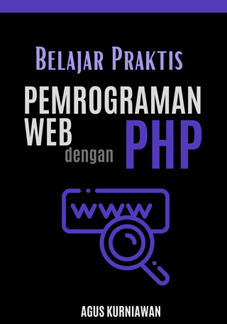

# Belajar Praktis Pemrograman Web dengan PHP

Dalam **Belajar Praktis Pemrograman Web dengan PHP**, Anda akan menemukan panduan terpadu yang menggali ke dalam setiap aspek pengembangan web menggunakan PHP. Dimulai dengan **Dasar-Dasar PHP**, buku ini membangun fondasi yang kokoh, membahas dari sintaks dasar hingga kontrol aliran dengan percabangan dan pengulangan. Bab ini diikuti oleh eksplorasi mendalam tentang **Pemrograman Berorientasi Objek dalam PHP**, memberikan Anda keterampilan untuk menulis kode yang lebih terstruktur dan efisien.

Memasuki dunia pengembangan web yang lebih praktis, buku ini memandu Anda melalui **Pengembangan Web dengan PHP** dan **Membangun REST API dengan PHP**, menunjukkan bagaimana PHP dapat digunakan untuk mengembangkan halaman web dinamis dan API yang aman dan efisien. Bab penting lainnya, **Interaksi dengan Database menggunakan PHP**, mengajarkan Anda bagaimana PHP berinteraksi dengan database, krusial untuk aplikasi web modern. Puncak dari pembelajaran Anda adalah **Studi Kasus: Pengembangan Aplikasi Booking Hotel**, di mana teori bertransformasi menjadi praktek nyata.

Buku ini dirancang bukan hanya sebagai sumber belajar, tetapi sebagai komponen esensial dalam toolkit setiap calon pengembang web. Dengan pembelajaran berbasis proyek dan fokus pada aplikasi praktis, **Belajar Praktis Pemrograman Web dengan PHP** adalah investasi ideal untuk siapa saja yang serius ingin menguasai PHP dan membangun aplikasi web yang responsif dan canggih. Ambil salinan Anda dan mulailah perjalanan Anda ke dunia pengembangan web yang menarik dengan PHP!

## Publikasi

* Google Play Books: 
* Lulu: https://www.lulu.com/shop/agus-kurniawan/belajar-praktis-pemrograman-web-dengan-php/ebook/product-p66k4gp.html

Untuk pengguna iOS, silakan gunakan Google Play Books. Kemudian dapat membeli buku ini melalui Google Play Books. Alternatif lain, pembelian buku dapat dilakukan melalui website Google Play Books.